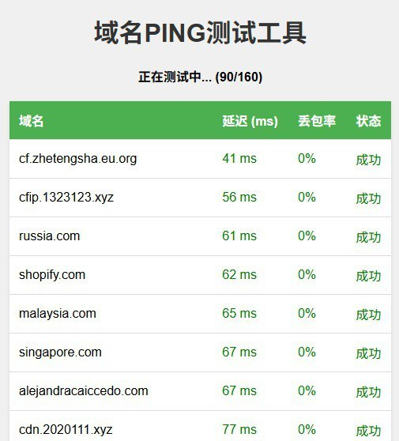

# CFping

A lightweight Cloudflare IP scanner with web UI for testing latency and download speed.



## Features

- TCP Ping test for IP connectivity and latency
- Download speed test through specified Cloudflare IP
- CIDR notation support (e.g., `1.1.1.0/24`)
- Real-time results via WebSocket
- Sortable results table
- Cross-platform (Windows, macOS, Linux)
- Auto-opens browser on startup

## Installation

### Prerequisites

- Go 1.24+

### Build from source

```bash
git clone https://github.com/yourusername/cfping.git
cd cfping
go build -o cfping
```

## Usage

```bash
./cfping
```

Or on Windows:

```cmd
run.bat
```

The server starts at `http://localhost:13334` and automatically opens in your default browser.

### Web Interface

1. Enter IP addresses or CIDR ranges (one per line)
2. Set the port (default: 443)
3. Set max latency filter (ms)
4. Click "Start Ping" for latency test or "Start Speed Test" for download speed test

### Speed Test URL

Default: `https://speed.cloudflare.com/__down?bytes=25000000`

You can customize this to test against different Cloudflare endpoints.

## Configuration

| Parameter | Default | Description |
|-----------|---------|-------------|
| Port | 443 | Target port for TCP connection |
| Max Latency | 400ms | Filter threshold for ping results |
| Max IPs | 10000 | Maximum IPs to scan per request |
| Concurrency | 50 | Parallel ping workers |

## Tech Stack

- Backend: Go + Gorilla WebSocket
- Frontend: Vanilla HTML/CSS/JS
